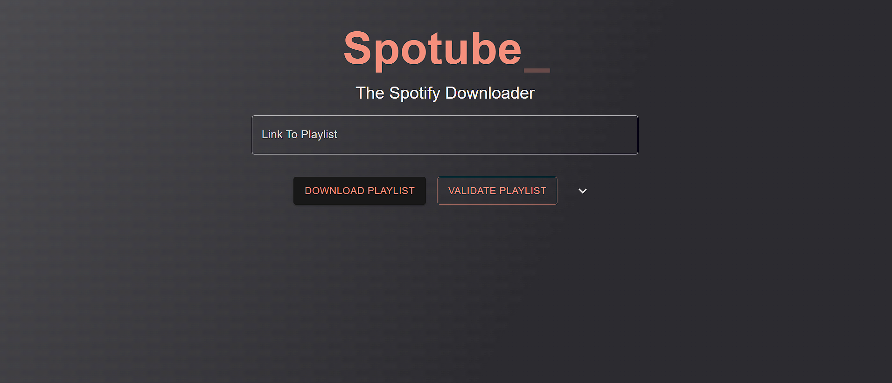
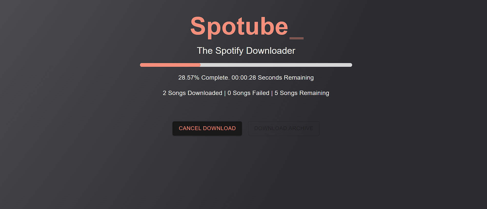

# Spotube-Web
#### Developed by [Giorgos Nikolaou](https://github.com/GiorgosNik) and [Angelina Panagopoulou](https://github.com/AngelPn) 

Spotube-Web is a Django Rest API and React Frontend application that enables users to download Spotify playlists as mp3 files from YouTube. 
Spotube-Web is live for you to download your playlists [here](https://giorgosnik.github.io/spotube-web/)
The application utilizes the `spotube-package` package for handling Spotify playlist processing at a low level.


## Features

- Download Spotify playlists by providing the playlist URL and necessary API keys.
- Retrieve detailed song information from Spotify, including official name, artists, and album cover art.
- Search for and download the most relevant song videos on YouTube based on song name and artist(s).
- Fetch lyrics using the LyricsGenius API and add them to the downloaded songs.
- Edit MP3 tags to set artist and album information, add lyrics, and set cover art.
- Optionally normalize the volume level of downloaded MP3 files.

\
_Landing Page_

\
_Download in progress_


## Getting Started

To get started with Spotube-Web locally, follow these steps:

### Prerequisites

- Node.js and npm installed for frontend development.
- Python and pip installed for backend development.
- Spotify and Genius API keys.

### Installation

1. Clone the repository:
   ```bash
   git clone https://github.com/lybrag1/spotube-web.git
   cd spotube-web
2. Install frontend dependencies:
   ```bash
    cd app
    npm install --forces
3. Install backend dependencies:
   ```bash
    cd ../server
    pip install -r requirements.txt
4. Configure environment variables:
   ```bash
    GENIUS_API_KEY          # The key used to access the LyricsGenius API
    SPOTIFY_CLIENT_ID       # ID used with Spotify API
    SPOTIFY_CLIENT_SECRET   # Secret used to authenticate with Spotify API
    SONG_NUMBER_LIMIT       # Application variable, used to set the max number of songs to download
    DJANGO_SECRET_KEY       # The Django cryptography key, used to protect against CSRF and other attacks
    REACT_APP_API_BASE_URL  # The url the React app will target for the backend. If running locally, set to "http://127.0.0.1:8000"
5. Run the backend server:
   ```bash
    python manage.py runserver
    pip install -r requirements.txt
6. Run the frontend app:
   ```bash
    cd ../app
    npm start
7. Visit http://localhost:3000 in your browser to use the Spotube-Web application.

## Usage
1. Open the Spotube-Web application in your browser.
2. Provide the Spotify playlist URL.
3. Customize any optional settings like sound normalization and lyric download.
4. Click the download button to initiate the playlist download process.
5. When the progressbar is full, click the Download button

## Detailed Explanation & Technologies Used

This section outlines the development methodology followed during the creation of Spotube-Web, and the general structure of the app.

### Technology Stack
Spotube-Web leverages the following technologies:
- **Backend:**      Django, using the Django Rest Framework
- **Frontend:**     React
- **Build Automation** GitHub Actions
- **Backend Hosting**  Azure WebApps
- **Frontend Hosting** GitHub Pages
- **Containerization and Container Hosting** Docker and DockerHub

### Detailed Operation
1. Each time the frontend is accessed, it generates a unique id. This id is provided to the backend, together with the playlist URL and other arguments, like the option to normalize the sound levels and download lyrics.
2. After receiving a request, the Django API creates a Downloader class object to match the unique id, initializes it with the given arguments, and starts the download.
3. The front-end will poll the backend to get the current progress and the expected time of completion.
4. When the download is complete, the "Download Playlist" button will become active. When clicked, the downloaded songs will be downloaded in several .zip files, so that each .zip is under a given size. This is used to circumvent the limit in the response sizes of Azure WebApp.

### Pipeline and Deployment
The project is tested and deployed with the help of GitHub actions.
When pushing to a feature branch or creating a pull request, the test suite is automatically run.
When merging to the main branch, the pipeline will:
1. Run the test suite
2. Create a docker image of the project
3. Upload the image to DockerHub
4. Deploy the image to Azure WebApps
5. Compile a static version of the frontend and deploy to Github Pages

## Contributing
If you want to contribute to Spotube-Web, follow these steps:

1. Fork the repository.
2. Create a new branch for your feature: `git checkout -b feature-name`.
3. Commit your changes: `git commit -m 'Add new feature'`.
4. Push to the branch: `git push origin feature-name`.
5. Submit a pull request.